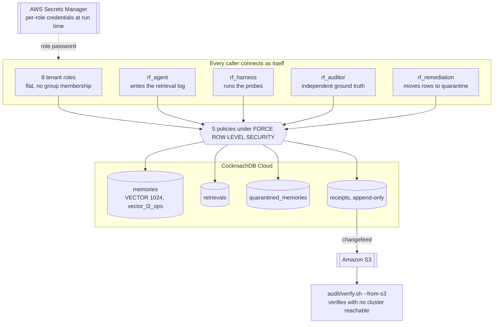
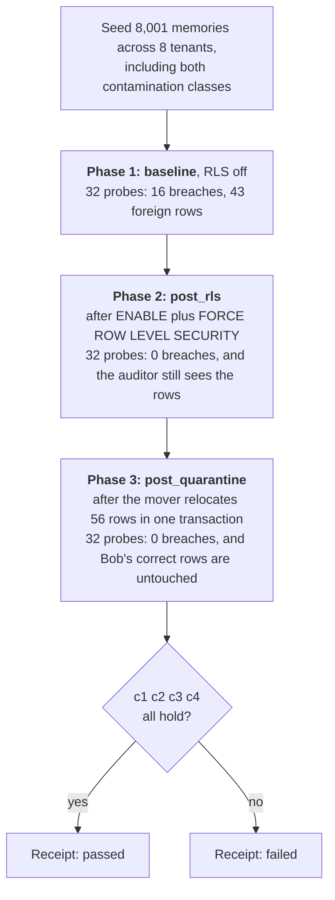
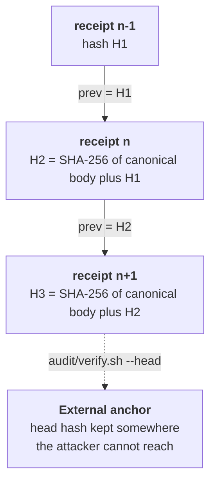

# RecallFence

Multi-tenant agentic memory with the isolation boundary in the database rather
than in application code.

An agent that remembers across sessions has to store what it learned somewhere,
and in a multi-tenant product that store is one forgotten `WHERE` clause away
from serving one customer's memory to another. The usual answer is to be careful
in application code. RecallFence puts the boundary in CockroachDB row-level
security instead, then tries to break it on purpose and emits a hash-chained
receipt saying whether it held.

What makes that more than an assertion: a deterministic breach harness that
probes the system from every tenant's own credentials, a repair loop that
separates *exposure* from *contamination*, and a hash-chained receipt that a
third party can verify without trusting this repo or the bucket it is stored in.

## The result

Measured on a live CockroachDB Cloud cluster, 8 tenants, 8,001 seeded memories
(7,945 remain in `memories` once quarantine moves 56), `VECTOR(1024)` embeddings,
4 probe types run under each tenant's own login:

```
  principal  probe                baseline  post_rls  post_quarantine
  --------------------------------------------------------------
  alice      direct_id            HIT       ok        ok
  alice      semantic_filtered    ok        ok        ok
  alice      semantic_unfiltered  HIT       ok        ok
  alice      side_channel         ok        ok        ok
  ...  (8 principals x 4 probes x 3 phases = 96 recorded results)

  43 foreign rows at baseline, 0 after RLS, 0 after quarantine.
```

`semantic_filtered` reading `ok` even at baseline is deliberate and is the most
important row in the table. The correctly scoped query was never the problem. The
product exists because the filter on the line above it gets forgotten, and a
matrix where every row failed would prove only that the fixture was broken.

A breach is scored on whether a returned row belongs to another tenant, never on
whether a marked phrase appeared. The definition matters: an earlier phrase-based
score reported a 35-row cross-tenant leak as clean.

## How the boundary is enforced

Every caller connects with its own credentials. There is no shared admin session
that later drops privileges, because a session that can `SET ROLE` can also
`RESET ROLE`, and the fence would be one statement deep.



Two enforcement layers sit behind that diagram and answer in opposite ways.
Missing a table privilege is a hard error, SQLSTATE 42501. Holding the privilege
while matching no policy affects zero rows and raises nothing. So the tests
compare affected-row counts against expectation instead of catching exceptions,
and a stray `GRANT` turns a loud failure into a silent one without touching a
single policy.

## What a pass actually requires

"No leaks after the fix" is a rubber stamp: a harness that errored silently and
recorded nothing also produces no leaks. A receipt passes only when all four
hold:

1. At least one breach at baseline. The failure has to be demonstrated before its
   absence means anything.
2. Zero breaches after RLS and after quarantine, across every principal and every
   probe type.
3. The auditor still saw the foreign rows at `post_rls`. RLS hiding a row and
   something having deleted the row both produce "zero rows returned". Without
   independent ground truth, a receipt cannot tell a working boundary from an
   emptied table.
4. Every probe in every counted phase has `status = ok`. Fail closed. An
   unexecuted probe is not a passed probe.

Clause 1 is the one that gets forgotten. Clause 3 is the one that makes the
result mean anything.



## Exposure and contamination are different problems

RLS repairs **exposure**: rows that were readable and should not have been.
Quarantine repairs **contamination**: rows that are *wrong*, because they were
written under the wrong tenant, or derived by an agent that had just read a
foreign row.

Keeping them apart is why there are two reruns rather than one. If cleanup ran
first, "no rows returned" would prove nothing, because an emptied table returns
nothing either. Probing after the fence goes up but before the cleanup is what
makes the two effects separable in the receipt.

It also decides what quarantine refuses to touch. Bob's refund ceiling leaked at
baseline, but it is correct data correctly attributed to Bob, and the defect was
in Alice's query path. Deleting Bob's memory to fix Alice's bug would be the
worse bug, so exposure alone never triggers quarantine. The committed bundle
shows it: rows `222075f5` and `60e6eb00` were exposed at baseline and stayed in
`memories`, while ten other rows attributed to Bob moved for provenance defects.

Contamination is a predicate on provenance, not a phrase match:

| Class | Reason code | Predicate |
|---|---|---|
| 1 | `misattributed_write` | `origin_tenant <> tenant` |
| 2 | `derived_from_foreign_read` | written in a session whose retrieval log returned a foreign row |

Measured: 24 and 32 respectively, 56 rows moved in one transaction, 0 remaining.

## The receipt

The artifact someone else keeps. It carries the full 96-row breach matrix, the
exact policy SQL that repaired the leak, the quarantined row IDs with reason
codes, the four-clause verdict, and a SHA-256 that chains it to its predecessor.

Tamper-evidence comes from the chain, not from the bucket. A changefeed writing
to S3 proves delivery, not integrity: anyone who can write the bucket, including
the changefeed's own IAM principal, can overwrite an object.



| Attack | Caught by |
|---|---|
| Edit a receipt body | Its own link: the stored hash no longer matches the body |
| Edit a body *and* recompute its hash | The **next** receipt, which committed to the old hash |
| Delete a receipt from the middle | The orphaned successor, whose `prev` names a hash no longer present |
| Rewrite the entire suffix | Nothing internal. Only an external anchor |

A hash chain cannot detect a total rewrite on its own, and
`tests/test_receipt_chain.sh` asserts exactly that: a fully rewritten chain is
internally consistent and verifies clean. The head hash pinned outside the system
is what convicts it, via `audit/verify.sh --head`. Receipts are chained, not
signed: no key is involved anywhere.

## Quickstart

Requires a CockroachDB connection URL, `jq`, and either a `cockroach` binary or
Apple's `container` runtime. Per-role credentials come from AWS Secrets Manager
at run time; nothing credential-shaped is in this repo.

```bash
export RF_CLUSTER_URL='postgresql://...'      # admin URL, never commit it

./schema/apply.sh tables
./schema/apply.sh roles alice bob carol ...   # asserts non-privileged, aborts if not
./fixtures/seed.sh plan && ./fixtures/seed.sh embed && ./fixtures/seed.sh load
./schema/apply.sh policies                    # order matters, see below

./harness/freeze.sh                           # pin the probe query vectors
./harness/run.sh baseline                     # probe the un-repaired system
./repair/loop.sh <baseline-run-id> --approve  # policy, rerun, quarantine, rerun
./audit/receipt.sh emit <baseline> <post_rls> <post_quarantine>

./cli/rf all                                  # every panel
./audit/verify.sh                             # recompute the hash chain
```

No cluster needed to see the recorded result or to exercise the chain:

```bash
./cli/rf --from web/public/replay.json all
./tests/test_receipt_chain.sh                 # 18 cases, hermetic
```

**Schema order is load-bearing.** Tables, then roles, then the fixture loader,
then policies. Under `FORCE ROW LEVEL SECURITY` an operation with no applicable
policy is denied for every role including the table owner, so seeding after the
fence goes up would require a policy that exists only to let the seeder cheat.
`schema/apply.sh` has no `all` subcommand for exactly this reason.

## Layout

```
schema/     tables, five role classes, the policy set, the changefeed
fixtures/   corpus, canaries, and both contamination classes, seeded deterministically
harness/    the four probes, auditor ground truth, the breach matrix
repair/     policy gate, quarantine mover, the two reruns
audit/      receipt writer, hash chain, chain verification
cli/        the same evidence as the dashboard, no web dependency
tests/      policy enforcement per role per operation, and chain tamper detection
web/        replay dashboard, rendered from a committed snapshot
docs/       architecture.md, three diagrams: the boundary, the proof, the receipt
```

[`docs/architecture.md`](docs/architecture.md) carries the same three diagrams
with the reasoning behind each, plus `.svg` and `.png` exports for anywhere that
cannot render Mermaid.

Comments in the schema and harness cite numbered spikes. Those were six
experiments run against a live cluster before the build, each settling one
question the code now depends on, such as whether an RLS policy disables the
vector index or what privileges `ccloud` hands a new user. Every citation states
its finding inline, so the comment stands on its own.

## CockroachDB tools and AWS services used

### CockroachDB

| Tool | Where | What it does here |
|---|---|---|
| **Distributed vector indexing** | `schema/001_tables.sql` | `VECTOR(1024)` on `memories` and `quarantined_memories`, indexed `ON memories (tenant, embedding vector_l2_ops)`. Backs the `semantic_unfiltered` and `semantic_filtered` probes, and produced the measured finding that under `FORCE ROW LEVEL SECURITY` the index stops being usable and retrieval degrades to an exact full scan. |
| **ccloud CLI (agent-ready)** | `schema/apply.sh`, `schema/lib/crsql.sh` | Resolves how to reach the cluster and drives schema application non-interactively. `schema/lib/crsql.sh` falls back to a containerised client on machines with no native binary. |

Row-level security is the boundary itself, applied in `schema/004_policies.sql`
and asserted in `schema/005_assert_roles.sql.tmpl`, which refuses to continue if
any managed role comes back `rolsuper`, `rolbypassrls`, or a member of `admin`.

`mcp/server.py` is a read-only MCP server shipped with this project, written
against the MCP stdio protocol, so an agent can query the breach matrix and
verify a receipt. It is not CockroachDB's Cloud Managed MCP Server and is not
counted toward the two required tools.

### AWS

| Service | Where | What it does here |
|---|---|---|
| **Amazon S3** | `schema/006_changefeed.sql.tmpl`, `audit/verify.sh` | A CockroachDB changefeed streams the `receipts` table to S3 as NDJSON with `resolved` markers, so silence in the bucket means the feed died rather than nothing having happened. `audit/verify.sh --from-s3` re-verifies the whole hash chain straight from the bucket with no cluster reachable; plain `audit/verify.sh` reads the database instead. |
| **AWS Secrets Manager** | `schema/apply.sh`, `tests/`, `agent/` | Every role's credentials are fetched at run time. Tests connect over each role's own credentials rather than `SET ROLE` from a shared admin session. Nothing credential-shaped is in the repo. |
| **AWS IAM** | `infra/provision.sh` | Mints the changefeed's write-only principal: `ListBucket` conditioned on the prefix, and an explicit `Deny` on every delete action, so the audit sink is append-only against its own writer. |
| **Amazon Bedrock** | `agent/lib/model.sh`, `fixtures/embed.sh` | `google.gemma-4-31b`, via the bedrock-mantle endpoint, phrases audit summaries whose facts are computed in SQL. Corpus embeddings use a deterministic local fallback; every receipt records the model ID that produced it, so a fallback is never presented as Titan. |

S3, Secrets Manager and IAM are load-bearing: remove any one and the receipt
cannot be delivered, the roles cannot authenticate, or the sink stops being
append-only. Bedrock affects the wording of audit summaries and the quality of
embeddings, never a verdict the receipt asserts.

## License

MIT. See [LICENSE](LICENSE).
