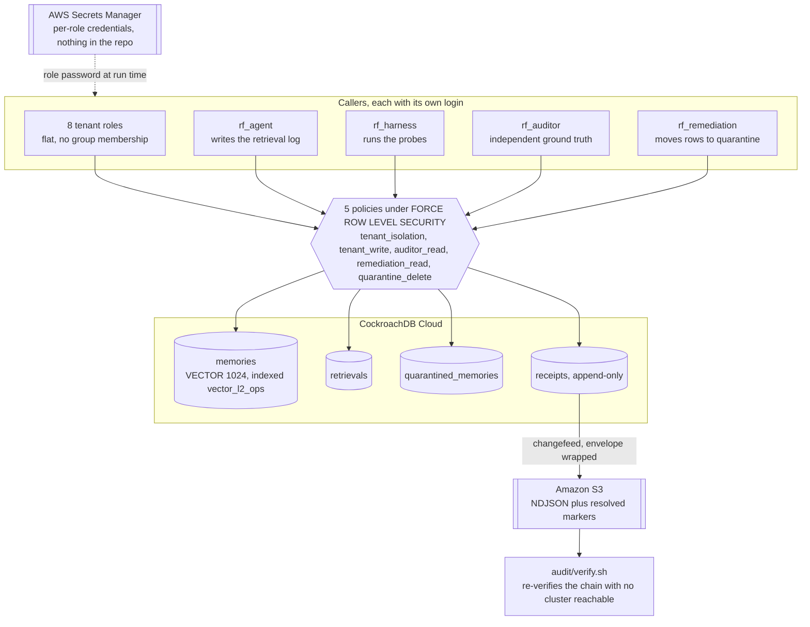
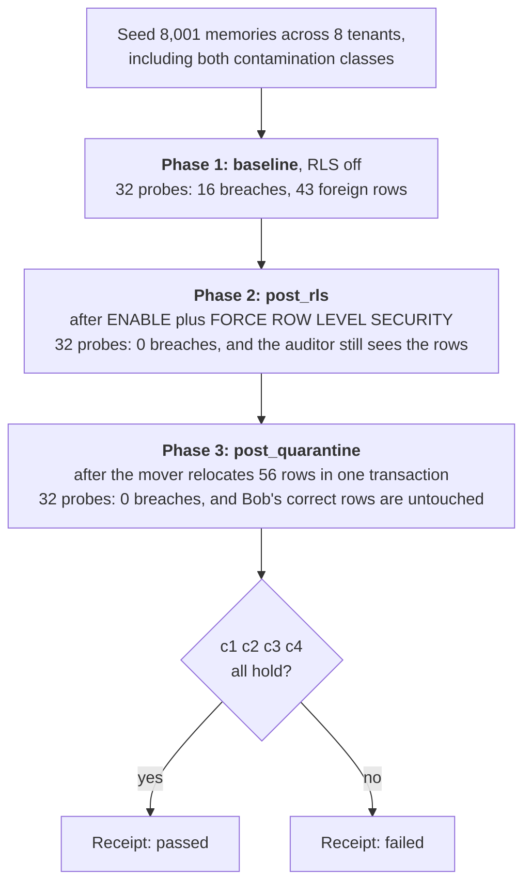
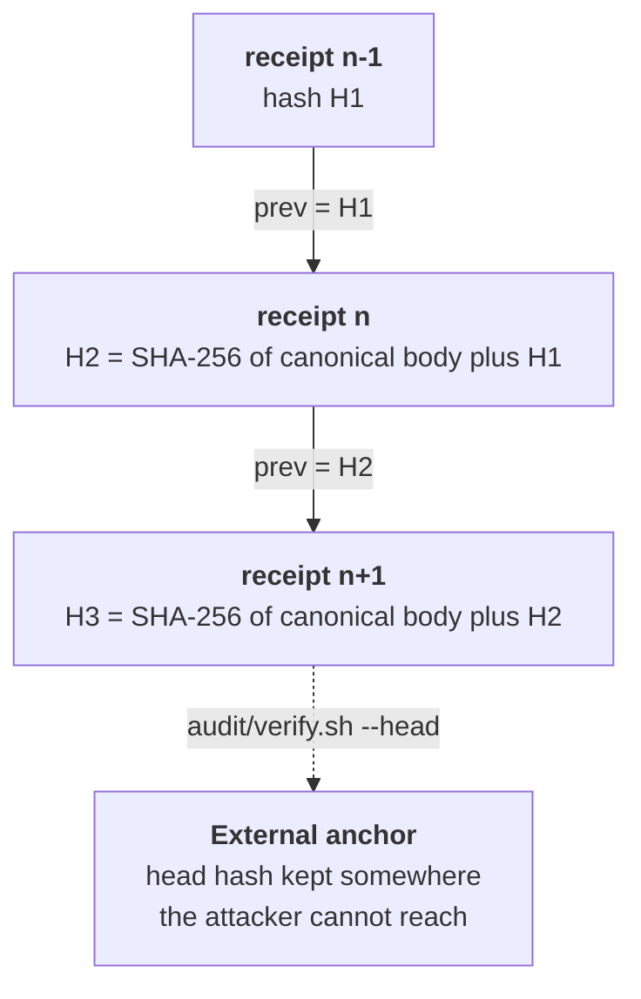

# Architecture

Three diagrams. The first shows where the fence sits, the second shows how the
proof is constructed, the third shows what the receipt is worth once someone
else is holding it.

They render on GitHub directly. Source is in this file, so a diagram that drifts
from the code is a diff, not a stale PNG nobody can edit.

`docs/diagrams/` holds the same three as `.mmd` source plus exported `.svg` and
`.png`, for places that cannot render Mermaid. Regenerate them after editing this
file rather than editing the exports:

```bash
awk '/^```mermaid$/{n++; b=1; next} /^```$/{b=0} b{print > ("docs/diagrams/tmp-" n ".mmd")}' docs/architecture.md
# then rename tmp-1..3 over the existing .mmd files and:
npx -y @mermaid-js/mermaid-cli@11 -i docs/diagrams/NAME.mmd -o docs/diagrams/NAME.png -b white -w 1800 -s 2
```

## 1. Where the boundary lives

Every caller connects with its own credentials, fetched from Secrets Manager at
run time. There is no shared admin session that later drops privileges, because
a session that can `SET ROLE` can also `RESET ROLE`, and the fence would be one
statement deep.



The auditor is the part that is easy to leave out and expensive to omit. RLS
hiding a row and something having deleted the row both produce "zero rows
returned". Without a principal that can still see the rows, a clean result
cannot be told apart from an emptied table.

## 2. How a pass is constructed

Three phases, because exposure and contamination are different defects and
collapsing them would make the result unreadable. If cleanup ran before the
second probe, "no rows returned" would prove nothing.



Clause 1 is the one that gets forgotten. A harness that errored silently and
recorded nothing also produces no leaks, so the failure has to be demonstrated
before its absence means anything.

Clause 3 is the one that makes the number mean something.

## 3. What the receipt is worth to a stranger

Delivery is not integrity. A changefeed writing to S3 proves the object arrived,
not that it says what it said yesterday. Anyone who can write the bucket,
including the changefeed's own IAM principal, can overwrite an object.



What each attack runs into:

| Attack | Caught by |
|---|---|
| Edit a receipt body | Its own link. The stored hash no longer matches the body |
| Edit a body and recompute its hash | The next receipt, which committed to the old hash |
| Delete a receipt from the middle | The orphaned successor, whose `prev` names a hash that is no longer present |
| Rewrite the entire suffix | Nothing internal. Only the external anchor |

The last row is the limit of what a chain can do alone, and
`tests/test_receipt_chain.sh` asserts it: a fully rewritten chain is internally
consistent and verifies clean. That is what `--head` is for. A total rewrite is
caught only by a head hash pinned outside the system.
